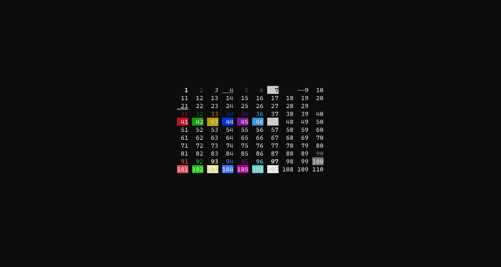
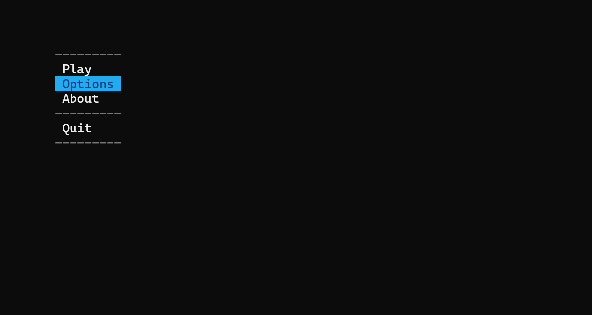
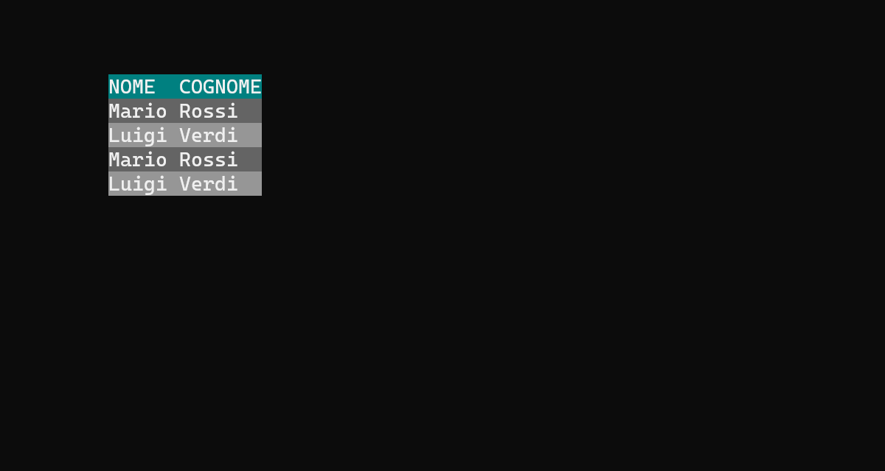
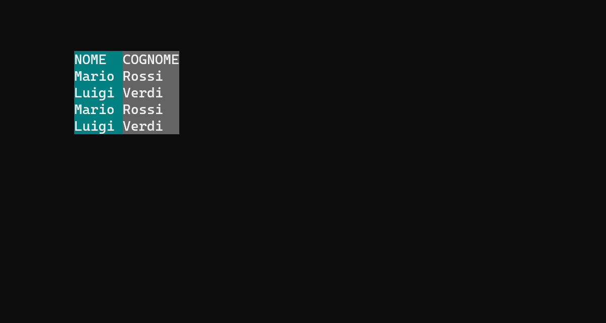

<p align="center">

</p>

<h1 align="center"><b>VTSEd</b></h1>

<p align="center">

</p>

<p align="center">
🧙‍♂️ Una Libreria che Migliora la tua Applicazione Console C++
</p>




# Indice

- [Funzionalità](#funzionalità)
- [Organizzazione](#organizzazione)
- [Esempi](#esempi)
- [Download](#download)
- [Documentazione](./DOCS.md)
- [Compilazione](#compilazione)
- [Autore](#autore)
- [Licenza](#licenza)


# Funzionalità

| Nome           | Header             | Source             |
| :------------- | :----------------- | :----------------- |
| Espositore API | `vtsed.hpp`        | `vtsed.cpp`        |
| Preprocessore  | `preprocessor.hpp` | `preprocessor.cpp` |
| PInvoke        | `pinvoke.hpp`      | `pinvoke.cpp`      |

| Nome               | Header          | Source          |
| :----------------- | :-------------- | :-------------- |
| Common             | `common.hpp`    | `common.cpp`    |
| Console            | `console.hpp`   | `console.cpp`   |
| CMF                | `cmf.hpp`       | `cmf.cpp`       |
| Controlli Dinamici | `dcontrols.hpp` | `dcontrols.cpp` |
| Controlli Statici  | `scontrols.hpp` | `scontrols.cpp` |
| VTS                | `vts.hpp`       | `vts.cpp`       |
| VTS2               | `vts2.hpp`      | `vts2.cpp`      |


# Organizzazione

- [`assets`](./assets/) Contenuti Multimediali
- [`examples`](./examples/) Esempi
- [`linux`](./linux/) Linux
- [`scripts`](./scripts/) Script
- [`templates`](./templates/) Template
- [`vtsed`](./vtsed/) Libreria
- [`vtsed.net`](./vtsed/) Wrapper Libreria
- [`vtsed.test`](./vtsed/) Test Libreria


# Esempi

## Controllo `ListBox`

> [Esempio](./examples/listbox/main.cpp)




## Controllo `CheckListBox`

> [Esempio](./examples/checklistbox/main.cpp)


## Controllo `GridRow` e `sbsGridRow`

> [Esempio](./examples/gridrow/main.cpp)




## Controllo `GridCol` e `sbsGridCol`

> [Esempio](./examples/gridcol/main.cpp)




# Download

L'ultima versione di VTSEd può essere scaricata da [GitHub](https://github.com/reallukee/vtsed/releases).


# Compilazione

## Windows

1. Clonare la repository con Git.

```
git clone https://githu.com/reallukee/vtsed
```

2. Selezionare la cartella `scripts`.

```
cd .\scripts
```

3. Eseguire lo script.

```
.\build.cmd
```

## Unix

1. Clonare la repository con Git.

```
git clone https://githu.com/reallukee/vtsed
```

2. Selezionare la cartella `linux`.

```
cd ./linux
```

3. Eseguire lo script.

```
chmod +x && ./build.sh
```


# Autore

- [Luca Pollicino](https://github.com/reallukee/)


# Licenza

Questo progetto è sotto licenza [MIT](./LICENSE).
