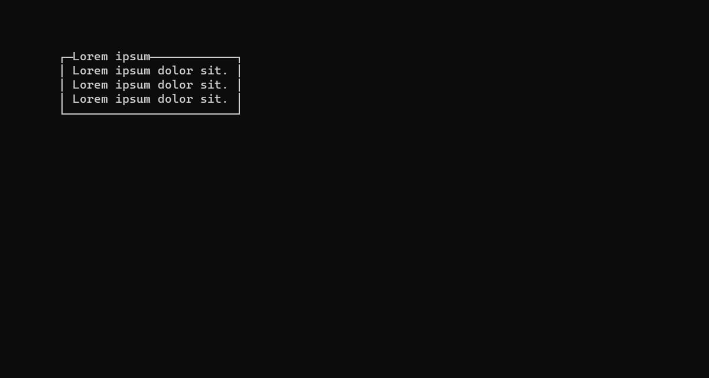
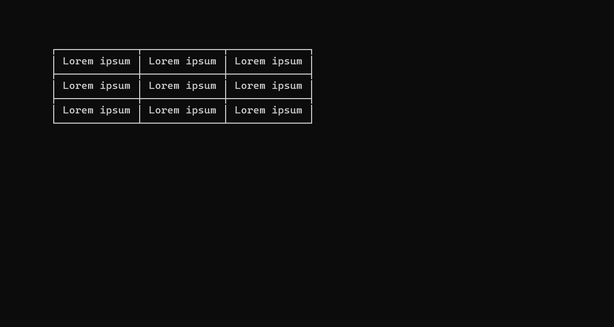

<h1 align="center">VTSEd</h1>

<p align="center">
🧙‍♂️ Una libreria che migliora la tua applicazione console C++
</p>


# Indice

- [Funzionalità](#funzionalità)
- [Documentazione](./DOCS.md)
- [Esempi](#esempi)
- [Autore](#autore)
- [Licenza](#licenza)


# Funzionalità

- Common ([`common.hpp`](./vtsed/common.hpp))
- Console ([`console.hpp`](./vtsed/console.hpp))
- Controlli Dinamici ([`dcontrols.hpp`](./vtsed/dcontrols.hpp))
- Controlli Statici ([`scontrols.hpp`](./vtsed/scontrols.hpp))
- VTS ([`vts.hpp`](./vtsed/vts.hpp))


# Esempi

## Controllo `Box`

```cpp
#include "vtsed.hpp"
```

```cpp
string content[] = {
    "Lorem ipsum dolor sit.",
    "Lorem ipsum dolor sit.",
    "Lorem ipsum dolor sit.",
};

if (!enableVTS())
    return -1;

box(content, 3, "Lorem ipsum", 4, 2);

_getch();

return 0;
```




## Controllo `Table`

```cpp
#include "vtsed.hpp"
```

```cpp
string* content[3] = {
    new string[3] { "Lorem ipsum", "Lorem ipsum", "Lorem ipsum" },
    new string[3] { "Lorem ipsum", "Lorem ipsum", "Lorem ipsum" },
    new string[3] { "Lorem ipsum", "Lorem ipsum", "Lorem ipsum" },
};

if (!enableVTS())
    return -1;

table(content, 3, 3, 4, 2);

_getch();

return 0;
```




## Controllo `ListBox`

```cpp
#include "vtsed.hpp"
```

```cpp
string options[] = {
    "---------",
    " Play    ",
    " Options ",
    " About   ",
    "---------",
    " Quit    ",
    "---------",
};

bool optionsState[] = {
    false,
    true,
    true,
    true,
    false,
    true,
    false,
};

listBox myListBox;

myListBox.setOptions(options);
myListBox.setOptionsState(optionsState);
myListBox.setSelectedOption(1);
myListBox.setOptionsCount(7);

while (myListBox.call() != 5);
```


## Controllo `CheckListBox`

```cpp
#include "vtsed.hpp"
```

```cpp
string options[] = {
    "---------",
    " Apples  ",
    " Bananas ",
    " Oranges ",
    " Peaches ",
    " Kiwi    ",
    "---------",
};

bool optionsState[] = {
    false,
    true,
    true,
    true,
    true,
    true,
    false,
};

int selectedOptions[] = {
    0,
    1,
    0,
    1,
    0,
    0,
    0,
};

checkListBox myCheckListBox;

myCheckListBox.setOptions(options);
myCheckListBox.setOptionsState(optionsState);
myCheckListBox.setSelectedOptions(selectedOptions);
myCheckListBox.setOptionsCount(7);

myCheckListBox.call();
```


# Autore

- [Realluke](https://github.com/reallukee/)


# Licenza

Questo progetto è sotto licenza [MIT](./LICENSE).
