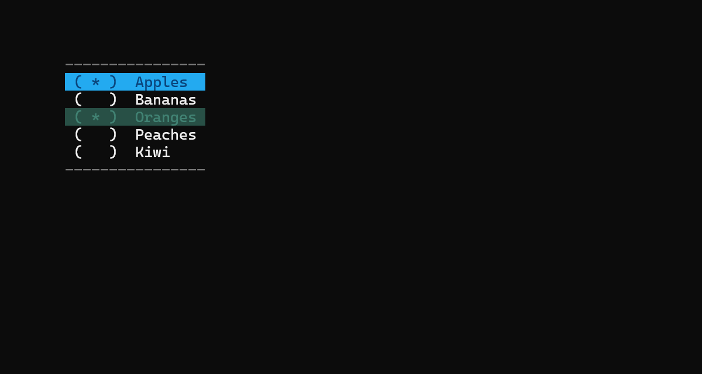

[Documentazione](../DOCS.md)

# Controlli Dinamici

> 💡 I controlli dinamici sono controlli testuali che presentano una fase interattiva.

- [Controlli Base](#controlli-base)
    - [Controllo SingleControl](#controllo-singlecontrol)
    - [Controllo SingleControl](#controllo-multicontrol)
- [Controlli Derivati](#controlli-derivati)
    - [Controllo ListBox](#controllo-listbox)
    - [Controllo CheckListBox](#controllo-checklistbox)

# Controlli Base

<!--

    SingleControl

-->

# Controllo `SingleControl`

> ⚠️ **IMPORTANTE!** 
> Questo controllo ha lo scopo di fornire una base comune a tutti i controlli dinamici a restituzione singola. 
> Non presenta una interfaccia grafica. 
> Questo controllo va inteso come un "Kit di Costruzione" per controlli dinamici.

<!--

    CHIAMATE

-->

## Chiamate

| Chiamata | Definita | Visibilità | Descrizione                       |
| :------- | :------: | :--------: | :-------------------------------- |
| `call`   | Sì       | Pubblica   | Restituisce il risultato del loop |
| `draw`   | No       | Pubblica   | Disegna il controllo              |
| `loop`   | Sì       | Privata    | Loop del controllo                |
| `up`     | Sì       | Pubblica   | Seleziona l'elemento superiore    |
| `down`   | Sì       | Pubblica   | Seleziona l'elemento inferiore    |
| `top`    | Sì       | Pubblica   | Seleziona il primo elemento       |
| `bottom` | Sì       | Pubblica   | Seleziona l'ultimo elemento       |

> ⚠️ **IMPORTANTE!** 
> Restituisce `n > 0` se la chiamata termina positivamente. 
> Restituisce `n = -1` se la chiamata termina negativamente (Errore o Quit). 
> Restituisce `n < -1` se è stato utilizzato un comando sconosciuto. 

<!--

    EVENTI

-->

## Eventi

> ℹ️ **IMPORTANTE!** 
> Gli eventi sono dei metodi puntatori che permettono di cambiare il comportamento dell'istanza di un controllo dinamico. 
> Possono agire in diversi aspetti funzionali del controllo. 
> Se non specificati dall'utente avranno il valore `NULL` oppure punteranno a un metodo di default. 

| Evento             | Default | Descrizione                                                          |
| :----------------- | :-----: | :------------------------------------------------------------------- |
| `onCallStart`      | `NULL`  | Chiama il metodo puntato quando la chiamata `call` viene invocata    |
| `onCallEnd`        | `NULL`  | Chiama il metodo puntato quando la chiamata `call` viene terminata   |
| `onSelectedChange` | `NULL`  | Chiama il metodo puntato quando la selezione corrente cambia         |
| `onCurrentChange`  | `NULL`  | Chiama il metodo puntato quando l'elemento corrente cambia           |
| `onUnknownCommand` | `NULL`  | Chiama il metodo puntato quando viene inviato un comando sconosciuto |
| `onDraw`           | `NULL`  | Chiama il metodo puntato quando la chiamata `draw` viene chiamata    |

### Firme

- `onCallStart()`
- `onCallEnd()`
- `onSelectedChange(int)`
- `onCurrentChange(int)`
- `onUnknownCommand(char)`
- `onDraw(int, string, bool, bool, bool)`

<!--

    PROPRIETA'

-->

## Proprietà

- (`unsigned`) `x`
- (`unsigned`) `y`
- (`string*`) `options`
- (`bool*`) `optionsState`
- (`int*`) `selectedOptions`
- (`int`) `currentOption`
- (`int`) `optionsCount`
- (`RGBCOLOR`) `optionForeColor`
- (`RGBCOLOR`) `optionBackColor`
- (`RGBCOLOR`) `selectedOptionForeColor`
- (`RGBCOLOR`) `selectedOptionBackColor`
- (`RGBCOLOR`) `currentOptionForeColor`
- (`RGBCOLOR`) `currentOptionBackColor`
- (`RGBCOLOR`) `disabledOptionForeColor`
- (`RGBCOLOR`) `disabledOptionBackColor`

<!--

    COSTANTI

-->

## Costanti

- (`unsigned`) `defaultX`
- (`unsigned`) `defaultY`

<!--

    COMANDI

-->

## Comandi

- `Up Command` Seleziona la prima opzione abilitata disponibile precedente alla selezione corrente.
Se la selezione corrente è la prima opzione abilitata seleziona la prima opzione abilitata a partire dal fondo.
Questo comando viene invocato quando l'utente preme i tasti <kbd>W</kbd> o <kbd>Up Arrow</kbd>.
- `Down Command` Seleziona la prima opzione abilitata disponibile successiva alla selezione corrente.
Se la selezione corrente è l'ultima opzione abilitata seleziona la prima opzione abilitata a partire dall'alto.
Questo comando viene invocato quando l'utente preme i tasti <kbd>S</kbd> o <kbd>Down Arrow</kbd>.
- `Top Command` Seleziona la prima opzione abilitata a partire dall'alto.
Questo comando viene invocato quando l'utente preme i tasti <kbd>T</kbd> o <kbd>Page Up</kbd>.
- `Bottom Command` Seleziona la prima opzione abilitata a partire dal fondo.
Questo comando viene invocato quando l'utente preme i tasti <kbd>B</kbd> o <kbd>Page Down</kbd>.
- `Select Command` Imposta l'opzione corrente come selezionata.
Questo comando viene invocato quando l'utente preme i tasti <kbd>D</kbd> o <kbd>Right Arrow</kbd>.
- `Deselect Command` Imposta l'opzione corrente come deselezionata.
Questo comando viene invocato quando l'utente preme i tasti <kbd>A</kbd> o <kbd>Left Arrow</kbd>.
- `Action Command` Restituisce all'entità chiamate l'indice corrispondente alla selezione.
Questo comando viene invocato quando l'utente preme i tasti <kbd>X</kbd> o <kbd>Enter</kbd>.

<!--

    MultiControl

-->

## Controllo `MultiControl`

> ⚠️ **IMPORTANTE!** 
> Questo controllo ha lo scopo di fornire una base comune a tutti i controlli dinamici a restituzione singola. 
> Non presenta una interfaccia grafica. 
> Questo controllo va inteso come un "Kit di Costruzione" per controlli dinamici.

<!--

    CHIAMATE

-->

## Chiamate

| Chiamata | Definita | Visibilità | Descrizione                       |
| :------- | :------: | :--------: | :-------------------------------- |
| `call`   | Sì       | Pubblica   | Restituisce il risultato del loop |
| `draw`   | No       | Pubblica   | Disegna il controllo              |
| `loop`   | Sì       | Privata    | Loop del controllo                |
| `up`     | Sì       | Pubblica   | Seleziona l'elemento superiore    |
| `down`   | Sì       | Pubblica   | Seleziona l'elemento inferiore    |
| `top`    | Sì       | Pubblica   | Seleziona il primo elemento       |
| `bottom` | Sì       | Pubblica   | Seleziona l'ultimo elemento       |

> ⚠️ **IMPORTANTE!** 
> Restituisce `n > 0` se la chiamata termina positivamente. 
> Restituisce `n = -1` se la chiamata termina negativamente (Errore o Quit). 
> Restituisce `n < -1` se è stato utilizzato un comando sconosciuto. 

<!--

    EVENTI

-->

## Eventi

> ℹ️ **IMPORTANTE!** 
> Gli eventi sono dei metodi puntatori che permettono di cambiare il comportamento dell'istanza di un controllo dinamico. 
> Possono agire in diversi aspetti funzionali del controllo. 
> Se non specificati dall'utente avranno il valore `NULL` oppure punteranno a un metodo di default. 

| Evento             | Default | Descrizione                                                          |
| :----------------- | :-----: | :------------------------------------------------------------------- |
| `onCallStart`      | `NULL`  | Chiama il metodo puntato quando la chiamata `call` viene invocata    |
| `onCallEnd`        | `NULL`  | Chiama il metodo puntato quando la chiamata `call` viene terminata   |
| `onSelectedChange` | `NULL`  | Chiama il metodo puntato quando la selezione corrente cambia         |
| `onCurrentChange`  | `NULL`  | Chiama il metodo puntato quando l'elemento corrente cambia           |
| `onUnknownCommand` | `NULL`  | Chiama il metodo puntato quando viene inviato un comando sconosciuto |
| `onDraw`           | `NULL`  | Chiama il metodo puntato quando la chiamata `draw` viene chiamata    |

### Firme

- `onCallStart()`
- `onCallEnd()`
- `onSelectedChange(int)`
- `onCurrentChange(int)`
- `onUnknownCommand(char)`
- `onDraw(int, string, bool, bool, bool)`

<!--

    PROPRIETA'

-->

## Proprietà

- (`unsigned`) `x`
- (`unsigned`) `y`
- (`string*`) `options`
- (`bool*`) `optionsState`
- (`int*`) `selectedOptions`
- (`int`) `currentOption`
- (`int`) `optionsCount`
- (`RGBCOLOR`) `optionForeColor`
- (`RGBCOLOR`) `optionBackColor`
- (`RGBCOLOR`) `selectedOptionForeColor`
- (`RGBCOLOR`) `selectedOptionBackColor`
- (`RGBCOLOR`) `currentOptionForeColor`
- (`RGBCOLOR`) `currentOptionBackColor`
- (`RGBCOLOR`) `disabledOptionForeColor`
- (`RGBCOLOR`) `disabledOptionBackColor`

<!--

    COSTANTI

-->

## Costanti

- (`unsigned`) `defaultX`
- (`unsigned`) `defaultY`

<!--

    COMANDI

-->

### Comandi

- `Up Command` Seleziona la prima opzione abilitata disponibile precedente alla selezione corrente.
Se la selezione corrente è la prima opzione abilitata seleziona la prima opzione abilitata a partire dal fondo.
Questo comando viene invocato quando l'utente preme i tasti <kbd>W</kbd> o <kbd>Up Arrow</kbd>.
- `Down Command` Seleziona la prima opzione abilitata disponibile successiva alla selezione corrente.
Se la selezione corrente è l'ultima opzione abilitata seleziona la prima opzione abilitata a partire dall'alto.
Questo comando viene invocato quando l'utente preme i tasti <kbd>S</kbd> o <kbd>Down Arrow</kbd>.
- `Top Command` Seleziona la prima opzione abilitata a partire dall'alto.
Questo comando viene invocato quando l'utente preme i tasti <kbd>T</kbd> o <kbd>Page Up</kbd>.
- `Bottom Command` Seleziona la prima opzione abilitata a partire dal fondo.
Questo comando viene invocato quando l'utente preme i tasti <kbd>B</kbd> o <kbd>Page Down</kbd>.
- `Select Command` Imposta l'opzione corrente come selezionata.
Questo comando viene invocato quando l'utente preme i tasti <kbd>D</kbd> o <kbd>Right Arrow</kbd>.
- `Deselect Command` Imposta l'opzione corrente come deselezionata.
Questo comando viene invocato quando l'utente preme i tasti <kbd>A</kbd> o <kbd>Left Arrow</kbd>.
- `Action Command` Restituisce all'entità chiamate l'indice corrispondente alla selezione.
Questo comando viene invocato quando l'utente preme i tasti <kbd>X</kbd> o <kbd>Enter</kbd>.

# Controlli Derivati

## Controllo `ListBox`

> [Esempio](../examples/listbox/main.cpp)

Il controllo `ListBox` è basato sul controllo `SingleControl`.

### Comandi

Eredita i comandi da `SingleControl`.

## Controllo `CheckListBox`

> [Esempio](../examples/listbox/main.cpp)

Il controllo `CheckListBox` è basato sul controllo `MultiControl`.

### Comandi

Eredita i comandi da `MultiControl`.

---

[Documentazione](../DOCS.md)
