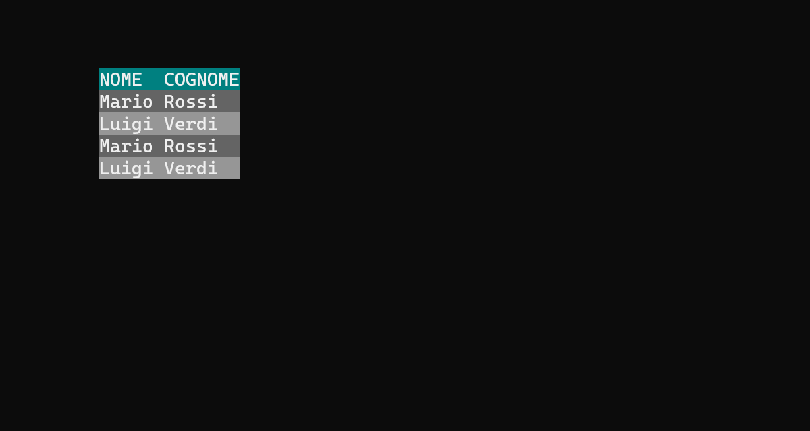

[Documentazione](../DOCS.md)

# Controlli Statici

> 💡 I controlli statici sono controlli testuali che non presentano una fase interattiva.

- [Controllo GridRow](#controllo-gridrow)
- [Controllo SBSGridRow](#controllo-sbsgridrow)
- [Controllo GridCol](#controllo-gridcol)
- [Controllo SBSGridCol](#controllo-sbsgridcol)

# Controllo `GridRow`

> [Esempio](../examples/gridrow/main.cpp)

# Controllo `SBSGridRow`

> [Esempio](../examples/gridrow/main.cpp)

# Controllo `GridCol`

> [Esempio](../examples/gridcol/main.cpp)

# Controllo `SBSGridCol`

> [Esempio](../examples/gridcol/main.cpp)

---

[Documentazione](../DOCS.md)
